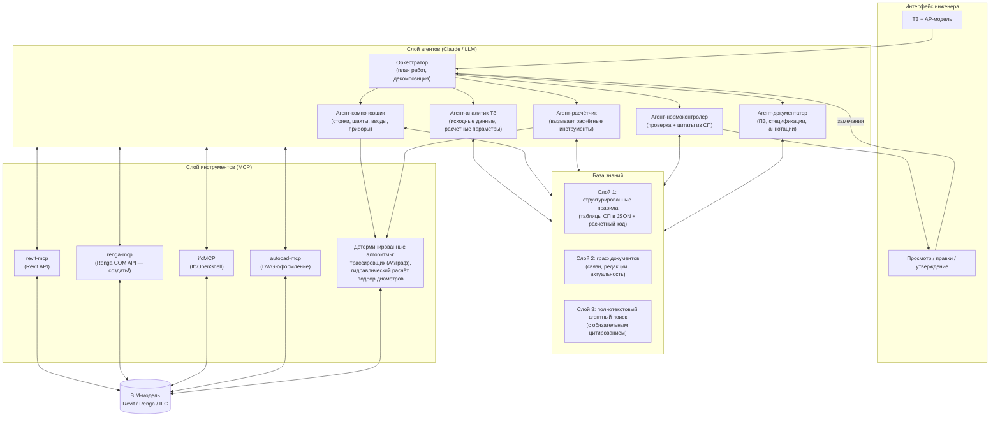

# Архитектура системы ИИ-проектирования раздела ВК

## 1. Четыре принципа

1. **LLM управляет, но не считает.** Языковая модель разбирает ТЗ, планирует работу,
   вызывает инструменты и объясняет решения. Расходы воды, уклоны, диаметры и трассы
   считают детерминированные алгоритмы и формулы из СП — их результат воспроизводим
   и проверяем. (Так же устроен MagiCAD — автотрассировка без ИИ; ИИ добавляет уровень
   «понять задачу и выбрать вариант».)
2. **Нормы ищутся и цитируются, а не вспоминаются.** Любое нормативное утверждение агента
   обязано сопровождаться ссылкой на документ/пункт, найденной поиском по реальной базе.
   Ответ без цитаты отбрасывается (см. исследование, §5).
3. **Проверка встроена в контур.** После каждого значимого шага нормопроверщик
   (rule-based + LLM) валидирует результат и возвращает список нарушений; агенты
   итеративно исправляют — как в Text2BIM.
4. **Инженер — точка принятия решений.** Система выдаёт черновик с протоколом решений
   («стояк Ст К1-1 размещён в шахте оси 3/Б, потому что…»); утверждает и подписывает человек.

## 2. Общая схема



## 3. Слой агентов: роли

Ролевая схема по образцу Text2BIM (4 агента) и, судя по описанию, «Норникеля»:

| Агент | Задача | Инструменты |
|---|---|---|
| **Оркестратор** | Ведёт весь процесс: декомпозиция ТЗ на задачи, порядок шагов, передача контекста между агентами, эскалация к инженеру | план/задачи |
| **Аналитик ТЗ** | Извлекает из ТЗ и АР-модели исходные данные: этажность, количество потребителей, гарантийный напор, точки подключения. Формирует «паспорт задачи». Задаёт инженеру уточняющие вопросы, если данных не хватает | чтение модели (MCP), база знаний |
| **Компоновщик** | Принципиальные решения: где стояки и шахты, зонирование систем (В1, Т3, К1…), места вводов, водомерный узел. Генерирует 2–3 варианта с обоснованием | чтение/запись модели, трассировщик, база знаний |
| **Расчётчик** | Запускает детерминированные расчёты: расходы по СП 30.13330 (приложение А), гидравлика, подбор диаметров, требуемый напор, проверка на насос | расчётный код (слой 1 базы знаний) |
| **Нормоконтролёр** | Проверяет каждый результат: уклоны, диаметры, расстояния, запреты прокладки. Работает в двух режимах: rule-based чек-листы (быстро, надёжно) + LLM-проверка с поиском по нормам (для нетиповых случаев). Каждое замечание — с цитатой пункта СП | база знаний, чтение модели |
| **Документатор** | Спецификации (выборка из модели + каталог производителя), пояснительная записка, аннотации на видах, ведомости | чтение модели, шаблоны документов |

Реализация: на старте — это просто **Claude Code / Claude Agent SDK с сабагентами**,
где каждая роль — отдельный системный промпт + свой набор MCP-инструментов. Никакой
собственной «агентной платформы» писать не нужно.

## 4. База знаний: три слоя

### Слой 1 — структурированные правила (самый ценный)

Таблицы и формулы СП переводятся вручную/полуавтоматически в машиночитаемый вид:

```yaml
# rules/sp30/uklony_kanalizacii.yaml
rule: min_slope_gravity_sewer
source: "СП 30.13330.2020, п. 8.7.3, табл. 8.3"
values:
  d50: {min_slope: 0.03, normal: 0.035}
  d110: {min_slope: 0.02, normal: 0.02}
```

```python
# calc/sp30/water_demand.py
def secondary_flow_probability(devices: list[Device]) -> float:
    """Вероятность действия приборов, СП 30.13330.2020 прил. А, ф. А.2"""
    ...
```

Эти правила: (а) вызываются агентами как инструменты; (б) используются rule-based
нормопроверщиком; (в) каждое несёт ссылку на источник — цитируемость бесплатно.
Для пилота ВК достаточно оцифровать **1–2 десятка ключевых таблиц** СП 30.13330 —
это дни работы, а не месяцы.

### Слой 2 — граф документов

СП/ГОСТ со связями «ссылается на», «заменён на», «изменение №». Минимальная реализация —
таблица метаданных + список актуальных редакций (сверяться с официальным перечнем
Минстроя). Защищает от главной бытовой ошибки — проектирования по отменённой редакции.

### Слой 3 — полнотекстовый агентный поиск

Полные тексты норм (структурированный Markdown, разбитый по пунктам с сохранением
нумерации). Поиск — не «один запрос к векторной базе», а **агентный контур**: модель
итеративно ищет (BM25 + векторный), читает пункты целиком, переходит по ссылкам между
пунктами, и обязана вернуть цитату. По данным эксперимента (см. исследование §5) это
снижает выдуманные ссылки на порядок. Реализация — обычный MCP-сервер поиска по локальной
базе (или готовый: Claude Projects / файловый поиск на старте).

## 5. Детерминированное ядро: трассировщик и расчёты

Это «несексуальная», но главная инженерная часть системы:

- **Трассировщик**: граф возможных путей строится из геометрии АР-модели (пространства,
  шахты, зоны под потолком/в полу, отверстия). Поиск пути — A*/Дейкстра с ограничениями:
  для К1 (самотёчной) — обязательный уклон и минимум поворотов, для В1/Т3 (напорных) —
  минимизация длины/пересечений. Выход — полилиния трассы, которую MCP-инструмент
  превращает в реальные трубы (`create_pipe`) с фитингами.
- **Гидравлика**: расчётные расходы (СП 30 прил. А) → скорость/потери по участкам →
  подбор диаметров из сортамента → требуемый напор. Всё — таблично-формульный код,
  тестируемый юнит-тестами против примеров из учебников.
- Позже сюда же: балансировка циркуляции ГВС, подбор насосной установки, аксонометрия.

LLM выбирает *какой* вариант трассы принять и *почему* (с учётом ТЗ и здравого смысла),
но сами трассы порождает алгоритм.

## 6. Пайплайн раздела ВК: от АР до документации

| # | Шаг | Кто делает | Контроль |
|---|---|---|---|
| 1 | Чтение АР-модели: этажи, помещения, санприборы, шахты | Аналитик через MCP | — |
| 2 | Нормализация исходных данных (недостающие приборы, привязки) | Аналитик + инженер | 🧑 инженер отвечает на вопросы |
| 3 | Паспорт задачи: потребители, расходы-прикидка, гарантийный напор из ТУ | Аналитик + Расчётчик | Нормоконтролёр |
| 4 | Концепция: системы (В1/Т3/К1…), стояки, шахты, ввод, водомер — 2–3 варианта | Компоновщик + трассировщик | 🧑 **инженер выбирает вариант** |
| 5 | Трассировка магистралей и подводок в модели | Трассировщик → MCP (`create_pipe`) | Нормоконтролёр (уклоны, зоны) + clash detection |
| 6 | Гидравлический расчёт, подбор диаметров, перерасчёт модели | Расчётчик | Нормоконтролёр |
| 7 | Спецификация (выборка из модели + каталог) | Документатор | 🧑 инженер |
| 8 | Текстовая часть: ПЗ по ПП № 87, ведомости | Документатор | Нормоконтролёр + 🧑 |
| 9 | Оформление чертежей: планы, аксонометрия, узлы, штампы по ГОСТ 21.601 | Документатор → MCP (виды/листы) | 🧑 **инженер утверждает** |

Точки 🧑 — обязательный human-in-the-loop; их три критических: выбор концепции,
приёмка спецификаций, утверждение комплекта.

## 7. Мультиплатформенность: как не жениться на одном САПР

Ядро системы (агенты, база знаний, трассировщик, расчёты) не должно зависеть от САПР.
Зависимый слой — только MCP-адаптеры:

| Платформа | Адаптер | Статус |
|---|---|---|
| Revit | готовые revit-mcp / pyRevit-серверы | ✅ брать готовое |
| IFC (бесплатно) | ifcMCP + IfcOpenShell + Bonsai | ✅ брать готовое |
| Renga | **renga-mcp — написать самим** (обёртка COM API на Python + FastMCP) | 🔨 1–2 недели, уникальная ценность |
| AutoCAD/nanoCAD | autocad-mcp (оформление 2D-документации) | ✅ брать готовое / адаптировать под nanoCAD |

Внутренний формат обмена — IFC (все платформы его читают/пишут): трассировщик и расчёты
работают с нейтральной моделью, адаптеры материализуют результат в родном формате САПР.
Это же отвязывает от лицензионных рисков Autodesk.

Дальше: [план реализации по этапам](03-plan-realizacii.md).
